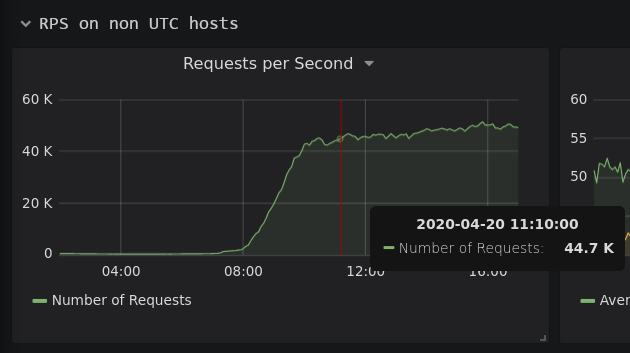

# Сказка о лишнем и потерянном времени. По версии py3
Несколько недель назад в нашей инфраструктуре я обнаружил небольшую ошибку конфигурации переменной окружения `TZ`. Исправление этой ошибки нарушило хрупкое равновесие багов во вселенной и графики RPS для одного из проектов в нашем графите буквально сошли с ума. Я расскажу, как гонялся за несколькими часами в течение нескольких дней.

## С чего всё началось
Скрипт, который запускался руками и прекрасно работал, выдавал ошибку при запуске из cron.d. Поверхностное исследование логов прямым текстом указывало, что же не так.

```bash
# Упрощённый пример ошибки
$ TZ='' clickhouse-client; echo exit=$?
ClickHouse client version 20.3.2.1.
Connecting to localhost:9000 as user default.
Connected to ClickHouse server version 20.3.2 revision 54433.

Poco::Exception. Code: 1000, e.code() = 0, e.displayText() = Exception: Could not determine time zone from TZ variable value: '': filesystem error: in file_size: Is a directory [/usr/share/zoneinfo] (version 20.3.2.1)
exit=232
```

### Ошибка у нас или в программе?
Верно ли поведение программы или это баг?

[Документация GNU](https://www.gnu.org/software/libc/manual/html_node/TZ-Variable.html) указывает, что есть 3 возможных формата переменной окружения `TZ`:

- Формат без DST (летнего времени): `std offset`. Примеры: `EST+5`, `GMT+0`
- Формат с DST: `std offset dst [offset],start[/time],end[/time]`. Пример: `EST+5EDT,M3.2.0/2,M11.1.0/2`.
- Имя файла описания часового пояса. Может начинаться с двоеточия `:`. Если первый (или следующий за двоеточием) символ это слэш `/`, то это должен быть абсолютный путь до файла. Если нет, то `/usr/share/zoneinfo/${TZ}`.

Зачем клиенту ClickHouse знания о локальном времени?

Внутреннее представление типов `Date` и `DateTime` в DBMS это timestamp, и при указании в запросе `toDateTime('2020-02-02 20:20:20')` клиент переводит это в `UInt32`. Разумеется, необходимы знания о часовом поясе. И явная ошибка в заданной переменной окружения `TZ` представляет собой, по моему мнению, вескую и достаточную причину немедленно завершить выполнение с ошибкой вместо 98% вероятности ошибочных данных при работе с датой и временем.

Стоит отметить, что первые два формата ClickHouse (или используемая в нём Poco) не поддерживает, но это уже выходит за рамки этой статьи. Пустая строка не может считаться ни одним из них.

### Исправление
Решение был очевидным, а исправление тривиальным. По умолчанию наш генератор конфигов для cron.d создавал каждую из задач с пустой переменной окружения `TZ`, если ничего не было указано. Я исправил пустую строку на полное отсутствие этой переменной. Добавил изменения в код, со среды 2020-04-15 они помариновались несколько дней в тестинге и в понедельник 2020-04-20 попали в прод.

## И заверте..
В среду 2020-04-22 руководитель эксплуатации приходит к админу одной из игр со словами (в вольной интерпретации): "За последние три дня в RPS сплошные вздржни"  


Вот проблемный [скрипт](https://github.com/innogames/igcollect/blob/8186876e92f244e2dc3d5c67f2e364697cf218d1/igcollect/logfile_values.py), считающий статистику по лог-файлам, на момент начала работы. А вот и проблемные места [номер один](https://github.com/innogames/igcollect/blob/8186876e92f244e2dc3d5c67f2e364697cf218d1/igcollect/logfile_values.py#L53) и [номер два](https://github.com/innogames/igcollect/blob/8186876e92f244e2dc3d5c67f2e364697cf218d1/igcollect/logfile_values.py#L259-L260).

```python
self.now = int(datetime.datetime.utcnow().timestamp())
...
dt = datetime.datetime.strptime(time_str, time_format).utctimetuple()
timestamp = time.mktime(dt)
```

### Что делает `datetime.utcnow()`?

> Return the current UTC date and time, with `tzinfo`=`None`.  
This is like `now()`, but returns the current UTC date and time, as a **naive** `datetime` object. An aware current UTC datetime can be obtained by calling `datetime.now(timezone.utc)`. See also `now()`.  
**Warning:** Because naive `datetime` objects are treated by many `datetime` methods as local times, it is preferred to use aware datetimes to represent times in UTC. As such, the recommended way to create an object representing the current time in UTC is by calling `datetime.now(timezone.utc)`.

Иными словами, этот метод возвращает время в поясе UTC, но без информации об этом в объекте `datetime`. Последующий вызов `.timestamp()` возвращает UNIX time для текущего часового пояса, но для времени UTC. Это значение может быть верным лишь в одном случае: если хост работает с `TZ=UTC`

Для корректного результата необходимо использовать метод `datetime.now().timestamp()`.

### Что делает `datetime.utctimetuple()`?

> `datetime.timetuple()`:  
Return `time.struct_time` such as returned by `time.localtime()`.

> `datetime.utctimetuple()`:  
If `datetime` instance *d* is naive, this is the same as `d.timetuple()` except that `tm_isdst` is forced to 0 regardless of what `d.dst()` returns. DST is never in effect for a UTC time.  
If *d* is aware, *d* is normalized to UTC time, by subtracting `d.utcoffset()`, and a `time.struct_time` for the normalized time is returned. `tm_isdst` is forced to 0.  
**Warning:** Because naive `datetime` objects are treated by many `datetime` methods as local times, it is preferred to use aware datetimes to represent times in UTC; as a result, using `utcfromtimetuple` may give misleading results. If you have a naive `datetime` representing UTC, use *datetime.replace(tzinfo=timezone.utc)* to make it aware, at which point you can use *datetime.timetuple()*.

Тут запутаннее. Оба метода возвращают `time.struct_time`, к которому впоследствии применяется `time.mktime()`. Моё предположение в том, что это было использовано в качестве [обратной совместимости с python2](https://stackoverflow.com/questions/30020988/python3-datetime-timestamp-in-python2). Не очень понятно, как данную конструкцию заставить работать в обоих версиях с предсказуемым результатом (и дальше я покажу, почему), но, хвала сообществу Python, уже и не надо, так как мы официально больше не поддерживаем вторую версию в компании.

Итак, во втором случае необходимо использовать `datetime.timestamp()` на результате `datetime.strptime()`

## Тестирование различных методов при различных значениях переменной `TZ`
Исправление скрипта было долгим и постепенным, так как наша инфраструктура неоднородна и имеются проекты с различными настройками. Где-то локальное время установлено по географическому признаку, где-то в UTC, а где-то установлено по географическому признаку, но парсит время для другого часового пояса. В общем, веселье.

После исправления первой проблемы, RPS для другого проекта выглядели вот так:  


На тот момент верное решение удалось найти благодаря удаче. В ретроспективе же стало интересно, как работает каждый из методов в различных условиях. Кейсы, которые пришли на ум:

- Сломанное значение часового пояса, значение `TZ=''`
- Локальное значение часового пояса отличается от UTC и от часового пояса строки для `strptime()`
- Локальное значение часового пояса UTC, отличается от часового пояса строки для `strptime()`
- Локальное значение часового пояса часовым поясом строки для `strptime()`

<spoiler title="Исходники тестов">

Скрипт python

```python
#!/usr/bin/env python

from datetime import datetime, timezone  # noqa
from time import mktime


def pprint(d: dict):
    for k in d:
        print("{}: {}".format(k, d[k]))


now = {'now': datetime.now(),
       # 'now_tz': datetime.now(timezone.utc), # the same as now for timestamp
       'utcnow': datetime.utcnow()}
now_ts = [int(now[k].timestamp()) for k in now]
now_dict = {k: [now_ts[i], now_ts[i] - now_ts[0]] for i, k in enumerate(now)}

pprint(now_dict)
# pprint(now)
# print('Timestamps in now: {}'.format(set(now_ts)))

print()

ts_c = 1587699115  # the known correct value
time_format = "%Y-%m-%dT%H:%M:%S%z"
time_str = "2020-04-24T05:31:55+02:00"

timetuples = {
    'timetuple': datetime.strptime(time_str, time_format).timetuple(),
    'utctimetuple': datetime.strptime(time_str, time_format).utctimetuple(),
}

ts = {
    'timestamp': [
        int(datetime.strptime(time_str, time_format).timestamp()),
        int(datetime.strptime(time_str, time_format).timestamp()) - ts_c,
    ],
    'timetuple': [
        int(mktime(timetuples['timetuple'])),
        int(mktime(timetuples['timetuple'])) - ts_c,
    ],
    'utctimetuple': [
        int(mktime(timetuples['utctimetuple'])),
        int(mktime(timetuples['utctimetuple'])) - ts_c,
    ],
}

pprint(ts)

# pprint(timetuples)
# print('Timestamps in ts: {}'.format(set(int(v[0]) for v in ts.values())))
```

Скрипт запуска python в с разными `TZ`

```bash
#!/usr/bin/env bash

for tz in '' Europe/Moscow UTC Europe/Berlin
do
  date "+==TZ=${tz} %s=="
  TZ=$tz python example.py
  date '+++%s++' -d '2020-04-24T05:31:55+02:00'
done
```

</spoiler>

### Сводные результаты
Ниже представлена таблица результатов использования методов при соответствующих значениях `TZ`

| метод \\ значение `TZ` | '' | отличное от строки | UTC | соответствующее строке |
|-------------------|--------|---------|-----|-------|
| now()/now(tz)     |   +    |    +    |  +  |   +   |
| utcnow()          |   +    |    -    |  +  |   -   |
| .timestamp()      |   +    |    +    |  +  |   +   |
| .timetuple()      |   -    |    -    |  -  |   +   |
| .utctimetuple()   |   +    |    -    |  +  |   -   |

Только `now` и `timestamp` гарантированно работают во всех случаях.

<spoiler title="Подробные результаты с разницей в секундах">

#### Сломанное значение часового пояса, значение `TZ=''`
```
==TZ= 1587914590==
now: [1587914590, 0]
utcnow: [1587914590, 0]

timestamp: [1587699115, 0]
timetuple: [1587706315, 7200]
utctimetuple: [1587699115, 0]
++1587699115++
```

#### Локальное значение часового пояса отличается от UTC и от часового пояса строки для `strptime()`
```
==TZ=Europe/Moscow 1587914590==
now: [1587914590, 0]
utcnow: [1587903790, -10800]

timestamp: [1587699115, 0]
timetuple: [1587695515, -3600]
utctimetuple: [1587688315, -10800]
++1587699115++
```

#### Локальное значение часового пояса UTC, отличается от часового пояса строки для `strptime()`
```
==TZ=UTC 1587914590==
now: [1587914590, 0]
utcnow: [1587914590, 0]

timestamp: [1587699115, 0]
timetuple: [1587706315, 7200]
utctimetuple: [1587699115, 0]
++1587699115++
```

#### Локальное значение часового пояса часовым поясом строки для `strptime()`
```
==TZ=Europe/Berlin 1587914590==
now: [1587914590, 0]
utcnow: [1587907390, -7200]

timestamp: [1587699115, 0]
timetuple: [1587699115, 0]
utctimetuple: [1587695515, -3600]
++1587699115++
```

</spoiler>

## Заключение
Замечательная Тикки Шельен [разумно советует](http://rowan.hole.ru/music/mp3/101008/10-Narcotime.mp3): "Не берите время голыми руками". Для меня в рейтинге опасности оно встало на одну строчку с DNS. Старайтесь, в целом, избегать его по возможности.

А в это интересное время желаю оставаться здоровыми. Постарайтесь сидеть дома и, если вдруг очень скучно и нечем заняться, можете поиграть в игры от [InnoGames](https://innogames.com). Кстати, у нас есть открытые [вакансии](https://www.innogames.com/career/)
