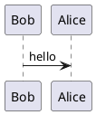
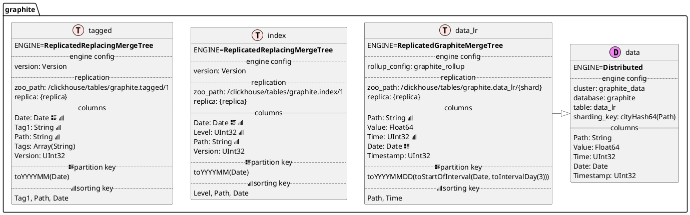

---
mainfont: DejaVuSerif.ttf
papersize: a4
geometry: margin=1cm
author: Mikhail Shiryaev
date: December 2019
linkcolor: blue
...

# Генератор диаграмм таблиц ClickHouse для PlantUML

Когда появляется необходимость документировать схемы баз данных, разные DBMS предоставляют свои инструменты для подобных задач. И большинство из них поддерживает `DESC table_name`, в том числе и ClickHouse. Однако, результат этой команды не столь выразителен, как хотелось бы.

```
DESCRIBE TABLE data_lr

name        type      default_type   default_expression   comment   codec_expression   ttl_expression
Path        String                                                  ZSTD(3)
Value       Float64                                                 Gorilla, LZ4
Time        UInt32                                                  DoubleDelta, LZ4
Date        Date                                                    DoubleDelta, LZ4
Timestamp   UInt32                                                  DoubleDelta, LZ4
```

При этом, системные таблицы `tables` и `columns` содержат исчерпывающую информацию, объединив которую, можно получить вот такой симпатичный результат:


<cut />

## Вдохновение

Перед тем, как начать заботливо пилить собственное решение, лищённое фатальных недостатков, я поискал доступные варианты. И вот эта [работа](https://www.red-gate.com/simple-talk/sql/sql-tools/automatically-creating-uml-database-diagrams-for-sql-server/) вдохновила меня начать собственный проект. Некоторые заготовки с благодарностью позаимствованы оттуда, с указанием авторства.

## Что такое PlantUML

Несколько слов о том, что это представляет из себя этот продукт. Для наилучшего понимания советую зайти на [официальную страницу](https://plantuml.com/). Если в двух словах, то это программа, которая преобразует текстовое описание диаграмм, например:



в изображения


Поддерживаются очень многие форматы, например [диаграммы прецедентов](https://plantuml.com/use-case-diagram), [классов](https://plantuml.com/class-diagram), [деятельности](https://plantuml.com/class-diagram), [компонентов](https://plantuml.com/component-diagram) и другие. Имеется [плагин](https://avono-support.atlassian.net/wiki/spaces/PUML/overview) для Atlassian Confluence, позволяющий использовать макрос и генерировать изображения прямо на страницах wiki. [Плагин](https://github.com/timofurrer/pandoc-plantuml-filter) для pandoc (и [не один](https://github.com/kbonne/pandoc-plantuml-filter)), для [LaTeX](https://ctan.org/pkg/plantuml), и многое другое.

Можно даже попробовать прямо на [сайте](http://www.plantuml.com/plantuml/uml/SyfFKj2rKt3CoKnELR1Io4ZDoSa70000).

## Идея

Идея проста: в таблице [system.tables](https://clickhouse.tech/docs/en/operations/system-tables/tables/) содержится общая информация о таблицах, движках, ключах партиционирования, сортировки и сэмплирования, и др. А в другой системной таблице, [system.columns](https://clickhouse.tech/docs/en/operations/system-tables/columns/), подробные данные о каждой из колонок. Комбинируя эти данные, можно легко сгенерировать часть, которая относится к колонкам и ключам таблиц. Это вторая половина каждой из таблиц на диаграмме.

## Реализация

Про таблицы с колонками ясно, но есть ещё одна часть, которой я уделил отдельное внимание. Каждый из движков таблиц имеет параметры, которые необходимо распарсить. Например, [ReplacingMergeTree](https://clickhouse.tech/docs/en/engines/table-engines/mergetree-family/replacingmergetree/) содержит опциональный параметр Version. И параметры определяются исключительно движком. Дополнительные параметры необходимы для создания [Replicated*MergeTree](https://clickhouse.tech/docs/en/engines/table-engines/mergetree-family/replication/#creating-replicated-tables). Также для [MaterializedView](https://clickhouse.tech/docs/en/sql-reference/statements/create/view/#materialized) всегда создаётся таблица с данными. Эту таблицу не имеет смысла показывать отдельно, и она отображается как отдельная часть конфига для MV.

Это было одной из самых интересных для меня частей проекта. Пришлось познакомиться с токенами и парсингом текста, хотя записать строки и идентификаторы в массив настроек движка оказалось ± легко. А уже при помощи них записать пары ключ-значение. И это первая половина таблиц на диаграмме.

Также некоторые таблицы зависят друг от друга. Например, [Distributed](https://clickhouse.tech/docs/en/engines/table-engines/special/distributed/) всегда указывает на локальные таблицы, а [Buffer](https://clickhouse.tech/docs/en/engines/table-engines/special/buffer/) располагается перед `*MergeTree` таблицами, чтобы принимать мелкие вставки. И для этих таблиц отдельно устанавливаются отношения. На диаграмме они представлены стрелочками.

## Результат

<spoiler title="Сгенерированная диаграмма и изображение">




</spoiler>

## Ближайшие планы

Добавить тесты, в идеале -  интеграционные с поддержкой нескольких версий ClickHouse. А также добавить генерацию диаграмм для кластеров ClickHouse. Возможно, кто-то найдёт для себя интересные кейсы и составит issue. Например можно добавить опциональное описание кодеков сжатия, хотя для меня они пока не важны.

# Вместо заключения

Я буду рад, если этот маленький проект позволит кому-то сэкономить время и предоставит возможность составить хорошую документацию.

Начать пользоваться можно, просто скачав модуль из pypi:

```
pip install clickhouse-plantuml
clickhouse-plantuml -h
```

Исходный код находится [здесь](http://github.com/Felixoid/clickhouse-plantuml).

#### Спасибо, что потратили время на прочтение!
