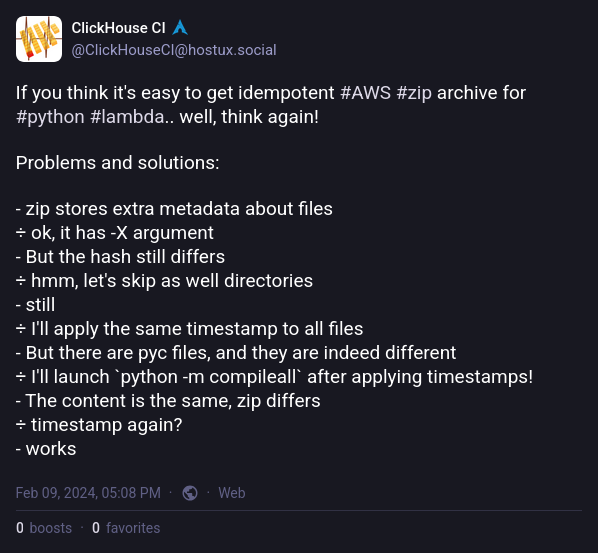

# Building environment independent consistent zip-archive for Python AWS lambda functions

In our CI/CD system we use lambda functions a lot. AWS provides two ways to deploy the lambda: docker images and ZIP archives.

The latter is much more lightweight, so we use it exclusively since [November 2022](https://github.com/ClickHouse/ClickHouse/pull/43769). Besides the artifact size, it was much easier to automate it in a simple [script](https://github.com/ClickHouse/ClickHouse/blob/1443e490ea5287175f031eaee567fe5024cd7306/tests/ci/team_keys_lambda/build_and_deploy_archive.sh).

In late 2023, started using terraform/OpenTofu. And it raised a question of "how should we manage artifacts to deploy?"

The question contains two different points:

- the artifact should not change the content after each rebuild
- ideally, it should be built on the fly, without any additional infrastructure on top, like pushing it to S3 or so

## Building metadata-independent ZIP archive on linux



### Challenge one: the order matters

There are many factors affecting the ZIP archive content. One of very unexpected (for me) is the order of archived files. Here's the example:

```bash
# create files 1 2 3 4 5
$ touch {1..5}
# archive them in sorted and reserved order
$ ls [1-5] | sort    | zip -q -0 --names-stdin sorted.zip
$ ls [1-5] | sort -r | zip -q -0 --names-stdin reversed.zip
# compare two files byte-by-byte
$ cmp -l sort.zip rev.zip
 31  61  65
 62  62  64
124  64  62
155  65  61
202  61  65
249  62  64
343  64  62
390  65  61
```

And here's the very first issue to solve. The order of files must be the same.

Besides that, we should omit passing the directories to the `zip` command. Otherwise it could cause inconsistency. The argument `-D` helps here.

So, here's the very first solved issue.

```bash
export LC_ALL=c
# zip uses random files order by default, so we sort the files alphabetically
find . ! -type d -print0 | sort -z | tr '\0' '\n' | zip -XD -0 ../"$PACKAGE".zip --names-stdin
```

The found files are null-divided, sorted, then null is replaced by a new line, and passed to the ZIP.

### Challenge two: age matters
This is the part of `man zip` about one of the arguments above:

```
    --no-extra
           Do not save extra file attributes (Extended Attributes on OS/2,
           uid/gid and file times on Unix).  The  zip  format  uses  extra
           fields  to include additional information for each entry.  Some
           extra fields are specific to particular  systems  while  others
           are applicable to all systems.  Normally when zip reads entries
           from  an  existing archive, it reads the extra fields it knows,
           strips the rest, and adds the extra fields applicable  to  that
           system.   With  -X, zip strips all old fields and only includes
           the Unicode and Zip64 extra fields (currently these  two  extra
           fields cannot be disabled).
```

So, it should ignore timestamps.. But!

```bash
$ touch -t 201212121212 {1..5}
$ zip -XD0q older.zip {1..5}
$ touch -t 201212121213 {1..5}
$ zip -XD0q newer.zip {1..5}
$ cmp -l older.zip newer.zip
 11 200 240
 42 200 240
 73 200 240
104 200 240
135 200 240
168 200 240
215 200 240
262 200 240
309 200 240
356 200 240
```

Somebody lies.. So another step we need to do before an archiving the files is changing the last modification time.

`find "$PACKAGE" ! -type d -exec touch -t 201212121212 {} +`

### Challenge three: python byte-code

According to the [recomendations](https://docs.aws.amazon.com/lambda/latest/dg/python-package.html#python-package-pycache), including `.pyc` files into the lambda archive speed-up the cold start of the lambdas, but can cause issues with the byte-code version. The byte-code version depends on the Python version and the system architecture.

After some experiments, we found that the best way to skip the `pyc` files is to use the `-x` option of the `zip` command.

### Final challenge: the OS matters

The last challenge is the OS. The ZIP archive format depends on the OS, where it was created. MacOS and Linux produce different ZIP archives, even if the content is the same. The difference is in the file attributes, like permissions and ownership.

Using the `-X` option of the `zip` command helps to omit these attributes, but it does not solve the problem completely. The best way we came with is using python to create the ZIP archive. Python's `zipfile` module creates a consistent ZIP archive, regardless of the OS. But to be completely sure, we use `python` from the `public.ecr.aws/lambda/python` image, which is the same as the one used by AWS Lambda.

```bash
docker_cmd=(
  docker run -i --net=host --rm --user="${UID}" -e HOME=/tmp --entrypoint=/bin/bash
  --volume="${WORKDIR}/..:/ci" --workdir="/ci/${DIR_NAME}" "${DOCKER_IMAGE}"
)

"${docker_cmd[@]}" -ex <<EOF
cd '$PACKAGE'
find ! -type d -exec touch -t 201212121212 {} +

python <<'EOP'
import zipfile
import os
files_path = []
for root, _, files in os.walk('.'):
    files_path.extend(os.path.join(root, file) for file in files)
# persistent file order
files_path.sort()
with zipfile.ZipFile('../$PACKAGE.zip', 'w') as zf:
    for file in files_path:
        zf.write(file)
EOP
EOF
```

## Building the virtual environment for the lambda

The code to address this challenge is quite simple. The only thing to remember is that the virtual environment should be created with the same Python version as the one used by AWS Lambda.

```bash
docker_cmd=(
  docker run -i --net=host --rm --user="${UID}" -e HOME=/tmp --entrypoint=/bin/bash
  --volume="${WORKDIR}/..:/ci" --workdir="/ci/${DIR_NAME}" "${DOCKER_IMAGE}"
)
rm -rf "$PACKAGE" "$PACKAGE".zip
mkdir "$PACKAGE"
cp app.py "$PACKAGE"
if [ -f requirements.txt ]; then
  VENV=lambda-venv
  rm -rf "$VENV"
  "${docker_cmd[@]}" -ex <<EOF
    '$PY_EXEC' -m venv '$VENV' &&
    source '$VENV/bin/activate' &&
    pip install -r requirements.txt &&
    # To have consistent pyc files
    find '$VENV/lib' -name '*.pyc' -delete
    cp -rT '$VENV/lib/$PY_EXEC/site-packages/' '$PACKAGE'
    rm -r '$PACKAGE'/{pip,pip-*,setuptools,setuptools-*}
    chmod 0777 -R '$PACKAGE'
EOF
fi
```

Here we check if the lambda function has a `requirements.txt` file. If it does, we create a virtual environment with the same Python version as the one used by AWS Lambda, install the dependencies, and copy the site-packages to the lambda package directory. To remove the unnecessary files, we delete the `pip` and `setuptools` directories as well as python byte-code files.

## Conclusion

The full script doing the job is available [here](https://github.com/ClickHouse/ClickHouse/blob/1443e490ea5287175f031eaee567fe5024cd7306/tests/ci/team_keys_lambda/build_and_deploy_archive.sh). Later it was removed from the repository, but it is still used in terraform/OpenTofu configuration to deploy the lambda functions.
